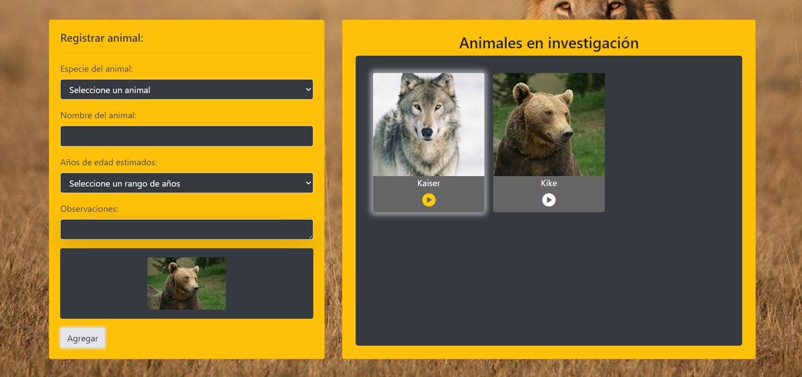
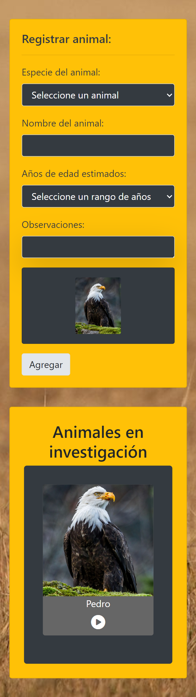

# Prueba - Programación avanzada en JavaScript

En esta prueba se validan los siguientes conocimientos:
- Crear clases con herencias
- Exportar e importar módulos
- Crear funciones autoejecutables IIFE
- Crear funciones async/await
- Crear instancias de clases
- Obtener y modificar elementos dle DOM

# Screenshots

## Descripción del código JavaScript

| Archivo     | Funciones/Clases/Métodos                                           | Descripción                                                                                                                                                                                                                                                                                                      |
|-------------|---------------------------------------------------------------------|------------------------------------------------------------------------------------------------------------------------------------------------------------------------------------------------------------------------------------------------------------------------------------------------------------------|
| animal.js   | - Clase `Animal`  - Métodos: `constructor`, `getName`, `getAge`, `getComment`, `getImg`, `getSound`, `createCard`, `playSound` | - Se define una clase `Animal` con un constructor que acepta parámetros para el nombre, edad, imagen, comentario y sonido del animal.   - Se implementan métodos para obtener los datos del animal.   - Se crea un método `createCard()` para generar dinámicamente una tarjeta HTML representando al animal.   - Se define un método `playSound()` para reproducir el sonido del animal. |
| especie.js  | - Subclases: `Leon`, `Lobo`, `Oso`, `Serpiente`, `Aguila`          | - Se importa la clase `Animal` desde `animal.js` y se definen subclases específicas para diferentes especies de animales.   - Cada subclase hereda de `Animal` y puede tener métodos específicos para cada especie.                                                                                             |
| data.js     | - Funciones: `rutaImagen`, `rutaSonido`, `animalData`              | - Se define una función autoejecutable (IIFE) para cargar los datos de un archivo JSON (`animales.json`) y almacenarlos en una variable.   - Se implementan funciones asincrónicas para obtener la ruta de la imagen y del sonido del animal seleccionado.                                                  |
| index.js    | - Eventos: `change`, `submit`, `click`                              | - Se importan módulos y funciones necesarios.   - Se añaden eventos para la interacción con el usuario, como cambios en el select de especie y clicks en la imagen de la tarjeta.   - Se implementan funciones para manejar la lógica de la aplicación, como instanciar objetos de animales y añadir tarjetas al contenedor.  |
